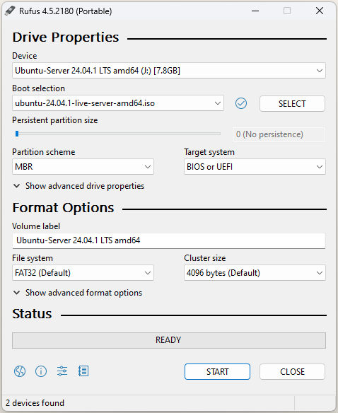

# dockerAtHome

Automated setup and maintenance of a self-hosted Docker environment on a home network using Ansible. The environment is air-gapped from the internet by design and serves as a platform for home applications such as recipe managers, e-book servers, monitoring dashboards, and more.

## Overview

The project automates the full lifecycle of a home server:

1. **Bare-metal OS installation** – Ubuntu 24.04 LTS via an unattended autoinstall (cloud-init)
2. **Base system provisioning** – Docker installation, NFS mounts, hostname, SSH banner, and git setup via Ansible
3. **Service deployment** – All Docker services are deployed through Ansible templates and `docker compose`
4. **OS maintenance** – Unattended system updates via a dedicated Ansible playbook

A Raspberry Pi acts as the Ansible control node. The primary Docker host (`jarvis`) runs on an Intel machine inside the home network (`192.168.10.x`).

## Architecture

```text
┌─────────────────────────┐      Ansible SSH      ┌──────────────────────────────┐
│   Raspberry Pi           │──────────────────────▶│   jarvis (Intel, Ubuntu 24)  │
│   Ansible Control Node   │                        │   Docker Host                │
└─────────────────────────┘                        └──────────────────────────────┘
                                                            │
                                        ┌───────────────────┼───────────────────┐
                                        ▼                   ▼                   ▼
                                   [Traefik]           [Monitoring]        [Applications]
                                  Reverse Proxy    Prometheus + Grafana   Mealie, COPS, WUD
```

## Deployed Services

| Service | Description |
| --- | --- |
| [Traefik](https://traefik.io/) | Reverse proxy and ingress controller |
| [Mealie](https://mealie.io/) | Self-hosted recipe manager |
| [COPS](https://github.com/mikespub-org/seblucas-cops) | Calibre OPDS/HTML e-book server |
| [WUD](https://fmartinou.github.io/whats-up-docker/) | Docker image update notifier |
| [Prometheus](https://prometheus.io/) | Metrics collection and storage |
| [Grafana](https://grafana.com/) | Monitoring dashboards |
| [cAdvisor](https://github.com/google/cadvisor) | Container resource metrics |
| [Node Exporter](https://github.com/prometheus/node_exporter) | Host system metrics |
| [FritzBox Exporter](https://github.com/pdreker/fritz_exporter) | AVM FritzBox router metrics for Prometheus |

## Repository Structure

```text
.
├── ansible/
│   ├── ansible.cfg
│   ├── inventory/
│   │   ├── hosts.yml               # Host definitions (Raspberry Pi, Docker host, playground)
│   │   └── group_vars/
│   │       └── all.yml             # Shared variables (paths, Docker user/group)
│   ├── playbooks/
│   │   ├── setup_system.yml        # Initial base system provisioning
│   │   ├── docker.yml              # Deploy all Docker services
│   │   └── update_system.yml       # OS package updates
│   └── roles/
│       ├── setup/                  # Base system role (Docker install, NFS, git, SSH banner)
│       ├── docker/                 # Service deployment role (all Docker containers)
│       └── update/                 # OS update role
└── Ubuntu_setup/
    ├── autoinstall.yaml            # Ubuntu cloud-init autoinstall configuration
    ├── user-data                   # Cloud-init user data
    ├── meta-data                   # Cloud-init meta data
    └── boot/grub/grub.cfg          # Custom GRUB config for autoinstall boot
```

## Prerequisites

- A Raspberry Pi (or any Linux machine) as the Ansible control node
- A target machine with at least one 64-bit Intel/AMD CPU, 8 GB RAM recommended
- An AVM FritzBox router on the home network (for the FritzBox Exporter)
- An NFS share available for automated backups
- Ansible installed on the control node:

  ```bash
  sudo apt install ansible
  ```

- Ansible Vault for secret management (FritzBox credentials are vault-encrypted)

## Getting Started

### 1. Prepare the Docker host

1. Download the latest [Ubuntu Server 24.04 LTS](https://ubuntu.com/download/server) ISO.
2. Create a bootable USB drive (e.g. with [Rufus](https://rufus.ie/)).

3. Copy `Ubuntu_setup/autoinstall.yaml`, `user-data`, `meta-data`, and `boot/grub/grub.cfg` to the USB drive root.
4. Boot the target machine from USB – the installation runs fully unattended.

> **Note:** `autoinstall.yaml` and `user-data` must be in Unix line endings (`LF`). Use `dos2unix` if needed.

### 2. Set up the Ansible control node (Raspberry Pi)

```bash
# Run the helper script to create the ansible system user
bash Ubuntu_setup/create_ansible_user.sh

# Copy your private SSH key
cp <YOUR_PRIVATE_KEY> /home/ansible/.ssh/
chmod 600 /home/ansible/.ssh/<YOUR_PRIVATE_KEY>
```

Configure `ansible/inventory/hosts.yml` with the correct IP addresses for your environment.

### 3. Test connectivity

```bash
ansible all -m ping
```

### 4. Initial system provisioning

```bash
ansible-playbook ansible/playbooks/setup_system.yml
```

This installs Docker, configures NFS mounts, sets hostnames, and prepares the git environment.

### 5. Deploy Docker services

```bash
ansible-playbook ansible/playbooks/docker.yml
```

This deploys all containers defined in the `docker` role using individual `docker compose` stacks.

## Maintenance

### Update all OS packages

```bash
ansible-playbook ansible/playbooks/update_system.yml
```

### Automated backup

The `docker` role installs a systemd service + timer that runs a backup script every night at **03:30** to the NFS mount at `/mnt/backup/docker`. No manual intervention is required after initial setup.

### Update Docker image versions

Image versions are centrally managed in `ansible/roles/docker/vars/main.yml`. Update the version strings there and re-run:

```bash
ansible-playbook ansible/playbooks/docker.yml
```

The playbook safely stops the existing container, applies the new compose file, and starts it again.

## Security Notes

- The environment is **not exposed to the internet**. All services are only reachable within the local home network via Traefik.
- Sensitive credentials (e.g. FritzBox monitor password) are stored encrypted with **Ansible Vault**.
- SSH access relies on **key-based authentication only**.

## Collection of hints and tipps to get the environment running

### ssh connection after reboot take several minutes

option 1:  
Edit /etc/ssh/sshd_config and set GSSAPIAuthentication=no

option 2:  
Edit ~/.ssh/config and add  

```bash
Host *
  GSSAPIAuthentication no
```

## Git

### Set your user information

Add your real name and email address manually via command line

```bash
git config --global user.name "FIRST_NAME LAST_NAME"
git config --global user.email "MY_NAME@example.com"
```

or edit your .gitconfig file, usually stored in your home directory

```bash
[user]
  name = "FIRST_NAME LAST_NAME"
  email = "MY_NAME@example.com"
```

### Using dedicated private key for github

Copy private key into ~/.ssh/

Edit ~/.ssh/config and add

```bash
Host github.com
  User git
  Hostname github.com
  IdentityFile ~/.ssh/<your_private_key_file>
```

Don't forget to set the required permissions

```bash
chmod 600 ~/.ssh/<your_private_key_file>
```

### Enable auto-versioning via github action

Use following commit formating to use automatic versioning and changelog.md update

```text
Patch release fix: fix a typo in configuration
Minor release feat: add new docker application
Major release feat!: Switch from docker to podman
              refactor!: Drop monitoring
Non release   docs: update README
              chore: cleanup unused variables
              ci: update workflow
```

The non release messages will not trigger a release.

## License

MIT
